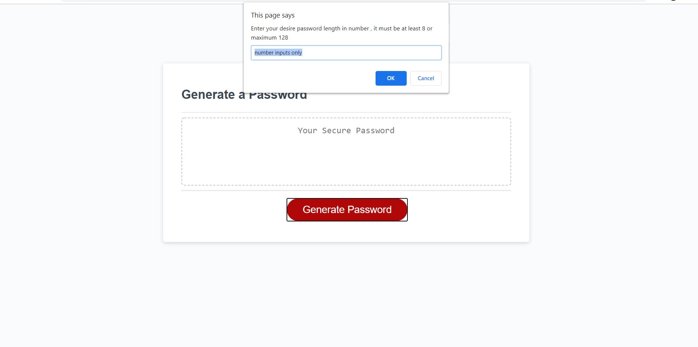
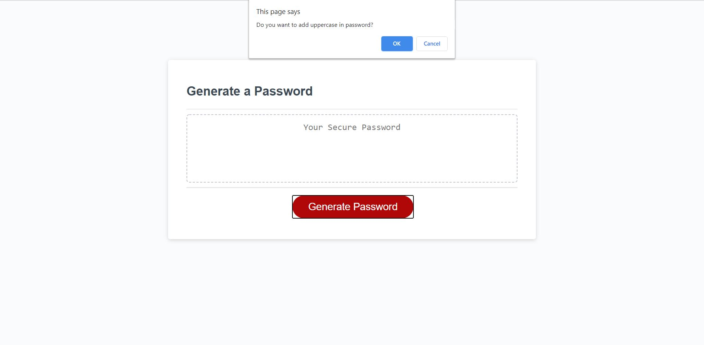

# Random Password Generator

# introduction
The aim this project was designed the application of generating random password through user's different inputs. 
The web application is consists of read, html, javascript, and css files, and it focuses to provide strong password where user can choose desire length of password ranging from 8 to 128 characters. Also, user able to choose any character type for password.

# deployment
This application is deployed on github pages, 
to see running application simply go through this link : 

# screenshots
Application overview showing numbers of steps to achieve random secure password
1. 

2. 

3. 

4. 

5. 

# 

